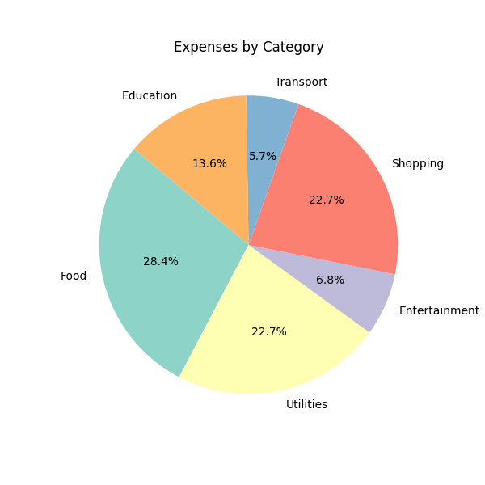
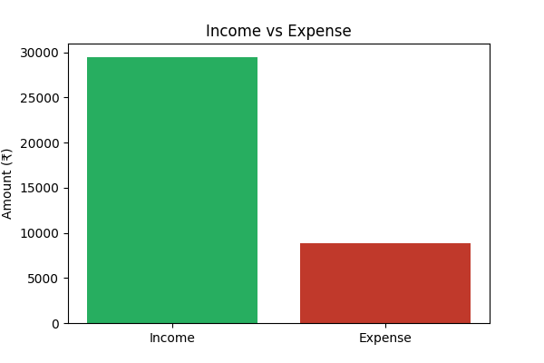

# Finance Analyzer Application

An academic team project developed using Python to analyze personal financial data and generate meaningful financial insights.

## Features
- Calculates total income, expenses, and net savings
- Category-wise expense analysis with percentage distribution
- Identifies highest income and expense categories
- Budget status detection to flag overspending
- Generates visualizations for income vs expense and category-wise spending
- Displays results using an HTML-based summary dashboard

## Technologies Used
- Python
- Pandas
- NumPy
- Matplotlib
- HTML

## Project Type
Academic Team Project (College App Submission)
## Output Preview

